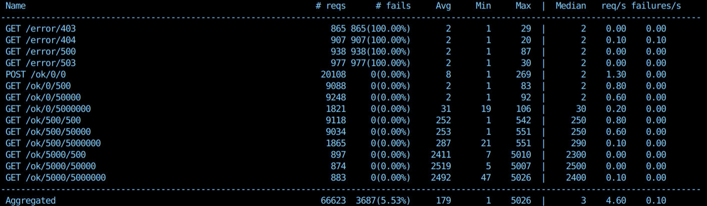

# Traffic Mirror
An API based server traffic generator. 



Traffic Mirror can generate different sizes of correct responses and errors with different codes. This is useful if you are testing load balancers or kubernetes services.

Main features: 
* Generate outbound traffic with different latency and size just by changing the url
* Generate different error codes just by changing the url
* Locust script to automate the traffic generation
* Support for POST method to generate inbound traffic 
* Docker image available for local or kubernetes deployment
* Lightweight
* Written in Go
* Free and open source (GPL)

# Installation
From docker image:
```
docker run -d --rm \
        --name traffic-mirror \
        -p 8080:8080 daviddetorres/traffic-mirror:latest
```

You can also deploy it in a Kubernetes cluster:
```
kubectl apply -f deployment.yaml
```

Building your source code
```
git clone https://github.com/daviddetorres/traffic-mirror
go build main.go -o traffic-mirror
```

# Usage
Onces started, traffic-mirror opens the port 8080 and waits for new petitions:
```
/ok/milliseconds/bytes  - Returns CODE:200 with random latency from 0 to 'milliseconds' and with a body filled with 0's 'bytes' times.
/error/code             - Returns error with the specified 'code'.
```

You can manually generate different requests with curl: 
```
curl http://localhost:8080/ok/500/1000
curl -d "00000" -X POST http://localhost:8080/ok/0/0
curl http://localhost:8080/error/403
```

Or bulk requests with load testers like [bombardier](https://github.com/codesenberg/bombardier)
```
docker run -ti --rm \
    --name bombardier \
    --net='host' \
    alpine/bombardier -r 11 -c 10 -d 10s -l http://localhost:8080/ok/100/10000
```


## Locust script
If you want something more sophisticated to generate queries, you can use the locust script and customize it as you wish. 

In command line:
```
locust -f traffic-generator.py --no-web -c 10 -r 10 -H http://localhost:8080
```

With a Docker image:
```
docker run -ti --rm \
  --net='host' \
  --volume $PWD:/mnt/locust \
  -e LOCUSTFILE_PATH=/mnt/locust/traffic-generator.py \
  -e TARGET_URL=http://localhost:8080 \
  -e LOCUST_OPTS="--no-web -c 10 -r 10 " \
  locustio/locust:0.14.4
```
